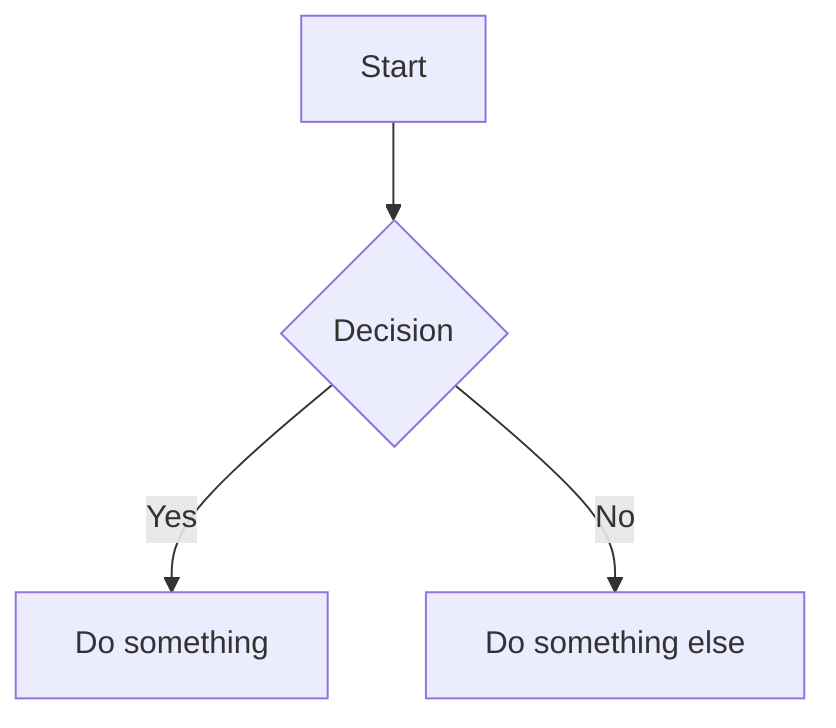

# mermaid-md

`mermaid-md` is a local Node.js app for browsing and editing Markdown documentation folders with Mermaid rendering built in.

It treats each documentation folder as a project root, gives you a docs-style reader UI, and watches files for live reload while you work locally.

## What It Does

- Render Markdown files as documentation pages
- Render Mermaid fenced code blocks inline
- Manage multiple documentation folders as separate projects
- Browse a project's folder tree from the sidebar
- Edit Markdown files in place from the browser
- Live reload open pages when Markdown files change
- Search within one project or across all projects
- Add favorites for commonly visited docs
- Generate a table of contents for longer pages
- Show reading progress while scrolling
- Support inline tooltips inside Markdown content

## Quick Start

```bash
git clone https://github.com/omnicus/mermaid-md.git
cd mermaid-md
npm install
npm start
```

Open `http://localhost:4000`.

## Running The App

Start the server:

```bash
npm start
```

Start the server and automatically add the current folder as a project root:

```bash
npm run dev
```

Start the server in watch mode so server-side code restarts on changes:

```bash
npm run dev:watch
```

Start the server and add a specific docs folder as a project root:

```bash
node server.js /path/to/docs
```

Set a custom port:

```bash
PORT=3000 npm start
```

Run it as a background service on startup with `systemd`:

1. Copy `systemd/mermaid-md.service` to `~/.config/systemd/user/mermaid-md.service`
2. Replace `/path/to/mermaid-md` in that file with your checkout path
3. Reload and enable the service:

```bash
systemctl --user daemon-reload
systemctl --user enable --now mermaid-md.service
loginctl enable-linger "$USER"
```

Check status:

```bash
systemctl --user status mermaid-md.service
```

Manage the service:

```bash
systemctl --user restart mermaid-md.service
systemctl --user stop mermaid-md.service
journalctl --user -u mermaid-md.service -f
```

## How Projects Work

A project in `mermaid-md` is just a folder on disk.

That folder becomes the project root. The app scans it for Markdown files, builds the navigation from the folders inside it, and only allows in-browser editing for Markdown files inside that root.

If you start the server with a path:

```bash
node server.js /Users/you/work/docs
```

that folder is added as a project and shown in the UI. You can also add more projects later from the app.

Project definitions are persisted in `~/.mermaid-server.json`.

## Recommended Project Structure

There is no required schema, but the easiest setup is one folder per documentation project with Markdown files organized into subfolders.

Example:

```text
product-docs/
  README.md
  getting-started.md
  architecture/
    architecture.md
    deployment.md
  guides/
    guides.md
    editing-content.md
    diagrams.md
  decisions/
    adr-001.md
```

How this maps in `mermaid-md`:

- `product-docs/` is the project root
- the root `README.md` becomes the project intro
- nested `README.md` files are ordinary pages
- every `.md` file inside that root is part of the project
- subfolders become part of the sidebar navigation
- a page matching its folder name becomes that folder's landing page, such as `guides/guides.md`
- opening a page keeps you inside that project context

## Adding Projects From The UI

1. Click `+ Add Project` in the sidebar.
2. Enter a project name.
3. Choose the folder that should act as that project's root.
4. Save the project.

## Editing And Live Reload

- Markdown files can be opened and edited directly in the browser
- Only `.md` files inside the selected project root are editable
- When files change, connected pages for that project reload automatically

## Writing Mermaid Diagrams

Add Mermaid diagrams with fenced code blocks:

````markdown

````

All [Mermaid diagram types](https://mermaid.js.org/intro/) supported by Mermaid can be used.

## Inline Tooltips

Add inline tooltips in Markdown with this syntax:

```markdown
{{Mandat|Bestillingen fra styret.\nEksempel: "Lag en plan som reduserer frafall i ungdomsfotballen innen oktober."}}
```

- Hover with a mouse or focus with the keyboard to show the tooltip
- Use `\n` for line breaks inside the tooltip text
- Escape `|` as `\|` inside tooltip content when needed

## Configuration

| Environment Variable | Default | Description |
| --- | --- | --- |
| `PORT` | `4000` | Server port |

## License

MIT
